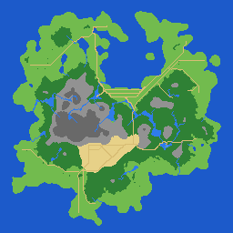
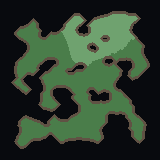
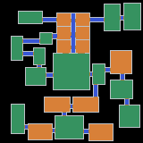
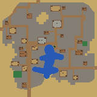
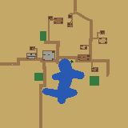
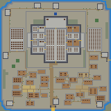

# AIMapImageGen

> [English README is here](README.md)

2D RPG 用のマップ画像を手続き的に生成するコマンドラインツールです。  
ワールドマップ・ダンジョン・洞窟・街・村・城の 6 種類のトップビューマップを出力します。

---

## 目次

1. [概要](#概要)
2. [フォルダ構成](#フォルダ構成)
3. [必要な環境](#必要な環境)
4. [ビルド方法](#ビルド方法)
5. [使い方](#使い方)
6. [バッチファイル](#バッチファイル)
7. [コードの拡張方法](#コードの拡張方法)

---

## 概要

生成できるマップの種類：

| タイプ | 説明 | 標準サイズ |
|--------|------|------------|
| `world` | フィールド（ワールドマップ） | 256×256 |
| `dungeon` | 屋内ダンジョン（部屋＋通路） | 160×160 |
| `cave` | 洞窟ダンジョン（自然な地形） | 160×160 |
| `town` | 街（入口・道路・広場・建物・公園） | 160×160 |
| `village` | 村（入り組んだ道・民家・畑・池） | 160×160 |
| `castle` | 城（堀・城壁・門・塔・本丸・内郭） | 160×160 |

各ピクセルが 1 ブロック（1 キャラ分）に対応し、バイオームごとに単色で塗り分けられます。  
出力画像を更に加工してハイトマップやテクスチャマップを生成することを想定しています。

## 出力画像例








---

## フォルダ構成

```
AIMapImageGen/
├── mapimggen.exe        ← ビルド後にここへコピーされる実行ファイル
├── bat/                 ← バッチファイル（ビルド・一括生成）
│   ├── build.bat
│   ├── generate_30_maps.bat
│   ├── generate_30_dungeon_160.bat
│   ├── generate_30_town_160.bat
│   ├── generate_30_village_160.bat
│   ├── generate_30_castle_160.bat
│   └── ...
├── build/               ← CMake ビルド出力（自動生成）
├── doc/                 ← 仕様書（生成アルゴリズムの詳細）
│   ├── mapgen_world.md
│   ├── mapgen_dungeon.md
│   └── mapgen_cave.md
│   ├── mapgen_town.md
│   ├── mapgen_village.md
│   └── mapgen_castle.md
├── sample/              ← サンプル画像
│   ├── worldmap/
│   ├── dungeon/
│   └── cave/
└── src/                 ← C++ ソースコード
    ├── CMakeLists.txt
    ├── main.cpp
    ├── MapImageGenerator.h
    ├── MapPlan.h
    ├── MapQuality.{h,cpp}
    ├── WorldMapImageGenerator.{h,cpp}
    ├── DungeonMapImageGenerator.{h,cpp}
    ├── CaveMapImageGenerator.{h,cpp}
    ├── TownMapImageGenerator.{h,cpp}
    ├── VillageMapImageGenerator.{h,cpp}
    ├── CastleMapImageGenerator.{h,cpp}
    └── utils.{h,cpp}
```

> バッチは `/bat`、ビルド成果物は `/build` に分離しています。  
> ビルド後、`bat/build.bat` が `mapimggen.exe` をルートフォルダへ自動コピーします。

---

## 必要な環境

| ソフトウェア | バージョン | 備考 |
|---|---|---|
| **Visual Studio** | 2019 以降推奨 | C++ デスクトップ開発ワークロードをインストールすること |
| **MSVC (Visual C++)** | C++17 以上 | Visual Studio に同梱 |
| **CMake** | 3.16 以上 | [cmake.org](https://cmake.org/download/) からインストール、またはVisual Studio インストーラーで追加可能 |

### インストール確認

```powershell
cmake --version
cl
```

どちらもコマンドが見つかれば準備完了です。  
`cl` が見つからない場合は「x64 Native Tools Command Prompt for VS」から実行してください。

---

## ビルド方法

### 方法 1：バッチファイルを使う（推奨）

```bat
bat\build.bat
```

このバッチが以下を自動実行します：

1. `src/` をソースとして CMake を構成（`/build` フォルダへ出力）
2. Release 構成でビルド
3. `build\Release\mapimggen.exe` をルートフォルダへコピー

### 方法 2：手動ビルド

```bat
cd src
cmake -S . -B ..\build -DCMAKE_BUILD_TYPE=Release
cmake --build ..\build --config Release
copy ..\build\Release\mapimggen.exe ..
```

---

## 使い方

```
mapimggen.exe -type <world|dungeon|cave|town|village|castle> [オプション]
```

### オプション一覧

| オプション | 説明 | デフォルト |
|---|---|---|
| `-type <world\|dungeon\|cave\|town\|village\|castle>` | マップ種別 | `world` |
| `-w <幅>` | 幅（ピクセル）。範囲: 64–1024 | world:256 / dungeon,cave,town,castle:160 |
| `-d <高さ>` | 高さ（ピクセル）。範囲: 64–1024 | world:256 / dungeon,cave,town,castle:160 |
| `-seed <数値>` | 乱数シード（再現用） | ランダム |
| `-dir <ディレクトリ>` | 出力先ディレクトリ | `.`（カレント） |
| `-out <ファイル名>` | 出力ファイル名（拡張子不要） | `out` |
| `--png` | PNG 画像を出力する | 有効 |
| `--data` | バイオーム CSV を出力する | 無効 |
| `--report` | 統計レポートを出力する | 無効 |
| `--plan` | biome配列・regions・markersをJSON出力する | 無効 |
| `--strict` | 品質検証NG時に終了コード7で失敗させる | 無効 |
| `-p <key=value>` | 詳細パラメータの個別指定 | — |

### 実行例

```bat
REM ワールドマップ（256×256、シード固定）
mapimggen.exe -type world -w 256 -d 256 -seed 12345 -dir out -out world_001 --png --report

REM ダンジョン（160×160、CSV データ付き）
mapimggen.exe -type dungeon -w 160 -d 160 -dir out -out dungeon_001 --png --data

REM 洞窟（デフォルトサイズ、PNG のみ）
mapimggen.exe -type cave -dir out -out cave_001 --png

REM 街（構造化Plan付き）
mapimggen.exe -type town -seed 12345 -dir out -out town_001 --png --report --plan

REM 村（農村型、家具region付き）
mapimggen.exe -type village -seed 12345 -dir out -out village_001 --png --report --plan --strict

REM 海岸の街 / 森の村（最新ビルドを使用）
build\Release\mapimggen.exe -type town -w 160 -d 160 -p settlementSite=1 -dir out -out coastal_town --png --plan --strict
build\Release\mapimggen.exe -type village -w 160 -d 160 -p settlementSite=3 -dir out -out forest_village --png --plan --strict

REM 城（品質NGをCIで検出）
mapimggen.exe -type castle -seed 12345 -dir out -out castle_001 --png --report --plan --strict
```

### 出力ファイル

| フラグ | ファイル名の例 | 内容 |
|---|---|---|
| `--png` | `world_001.png` | バイオーム色分け画像 |
| `--data` | `world_001.csv` | バイオーム ID の 2D 配列 |
| `--report` | `world_001_report.txt` | バイオーム統計サマリー |
| `--plan` | `world_001_plan.json` | biome配列、archetype、regions/markers、品質判定、意味リンク |

---

## バッチファイル

| ファイル | 内容 |
|---|---|
| bat/generate_30_all.bat | 6種類を各30枚、PNG/CSV/Plan/レポート付きで一括評価 |
| `bat/build.bat` | ビルドして exe をルートへコピー |
| `bat/generate_30_maps.bat` | ワールドマップ 30 枚を一括生成（256×256） |
| `bat/generate_30_maps_128.bat` | ワールドマップ 30 枚（128×128） |
| `bat/generate_30_maps_512.bat` | ワールドマップ 30 枚（512×512） |
| `bat/generate_30_dungeon_128.bat` | ダンジョン 30 枚（128×128） |
| `bat/generate_30_dungeon_160.bat` | ダンジョン 30 枚（160×160） |
| `bat/generate_30_dungeon_256.bat` | ダンジョン 30 枚（256×256） |
| `bat/generate_30_cave_160.bat` | 洞窟 30 枚（160×160） |
| `bat/generate_30_town_160.bat` | 街 30 枚（Plan/レポート付き、160×160） |
| `bat/generate_30_village_160.bat` | 村 30 枚（Plan/レポート付き、160×160） |
| `bat/generate_settlement_sites_160.bat [seed]` | 7立地の街・村を対にして生成（14枚） |
| `bat/generate_30_castle_160.bat` | 城 30 枚（品質strict、160×160） |

| スクリプト | 内容 |
|---|---|
| `tools/evaluate_town_castle.ps1` | town/village/castle の30 seed評価、全アーキタイプ評価、品質ゲート、アーキタイプ分布、seed間のPlan多様性、同一seedの再現性を確認します。 |
| `tools/evaluate_town_castle_sizes.ps1` | 64〜1024 のサイズ行列を strict 生成してサイズ適応を検査します。 |
| `tools/validate_town_castle_plan.ps1` | Plan JSON の寸法、座標、marker の region リンク、semantic role、扉/橋 tile の整合性、region の親子関係を検証します。 |

生成結果は `out/<タイムスタンプ>/` に保存されます。

---

## コードの拡張方法

### 新しいマップタイプを追加する

既存の仕様書（`doc/mapgen_world.md` → `doc/mapgen_dungeon.md` → `doc/mapgen_cave.md` → `doc/mapgen_town.md` → `doc/mapgen_castle.md`）が派生の実例です。
新しいマップタイプを追加する手順は以下の通りです。

#### 1. 仕様書を作成する

`doc/mapgen_<新タイプ>.md` を作成し、生成アルゴリズム・バイオーム・目標地形を記述します。  
既存の仕様書（特に `mapgen_dungeon.md`）を参考に、差分だけを明記すると整理しやすいです。

#### 2. GitHub Copilot でコードを生成する

仕様書が整ったら、VS Code の Copilot Chat（エージェントモード）に以下のように依頼します：

```
doc/mapgen_<新タイプ>.md の仕様に従い、
MapImageGenerator を継承した <新タイプ>MapImageGenerator クラスを
src/<新タイプ>MapImageGenerator.h と src/<新タイプ>MapImageGenerator.cpp に実装してください。
既存の DungeonMapImageGenerator を参考にしてください。
```

> 既存の仕様書と実装ファイルをコンテキストとして与えると、Copilot が構造を理解して実装を生成しやすくなります。

#### 3. 基底クラスのインターフェース

```cpp
// src/MapImageGenerator.h
class MapImageGenerator {
public:
    virtual ~MapImageGenerator() = default;
    virtual bool Generate(MapPlan& outPlan, std::string& outError) = 0;
};
```

新しいクラスはこの `Generate()` を実装するだけで `main.cpp` に組み込めます。

#### 4. main.cpp に登録する

`src/main.cpp` の生成器選択部分に新タイプを追加します：

```cpp
#include "<新タイプ>MapImageGenerator.h"

// MapTypes() に default size と factory を登録する
{"<newtype>", 160, 160, [](MapGenParams p) {
    return std::unique_ptr<MapImageGenerator>(
        std::make_unique<NewTypeMapImageGenerator>(std::move(p)));
}}
```

#### 5. CMakeLists.txt に追加する

```cmake
add_executable(mapimggen
    main.cpp
    <新タイプ>MapImageGenerator.cpp
    ...
)
```

#### 仕様書ドリブン開発のポイント

- 仕様書に「目標地形」の特徴を箇条書きで明記すると、Copilot がパラメータを適切に設定しやすくなります。
- `sample/` フォルダにサンプル画像を置いておくと、仕様書と合わせて Copilot への説明精度が上がります。
- 生成結果が期待と異なる場合は、仕様書の該当セクションを修正して再生成を依頼するイテレーションが効果的です。

---

## ライセンス

このプロジェクトは [MIT ライセンス](LICENSE) で公開されています。

使用・コピー・改変・再配布・商用利用など、自由に利用できます。
